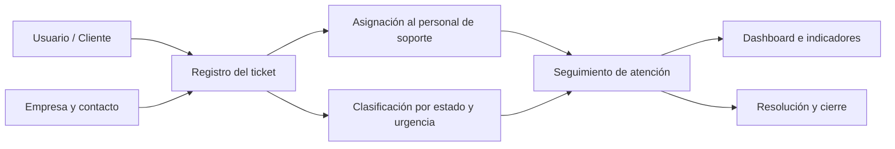

# Ticketera · Sistema de gestión de tickets para soporte TI

<p align="left">
  
  
  
  
  
</p>

Proyecto académico orientado a construir una **solución web de Mesa de Servicio (Help Desk)** para centralizar la atención de incidencias de soporte TI. La aplicación transforma requerimientos dispersos en **tickets trazables**, clasificables por urgencia, asignables al personal de soporte y visibles mediante un **dashboard operativo**.

🔗 **Enlaces**
- 🌐 **Portafolio:** [arcan.freedev.app](https://arcan.freedev.app)
- 💼 **LinkedIn:** [José Gustavo Silva Medrano](https://www.linkedin.com/in/jose-gustavo-silva-medrano/)
- 👨‍💻 **GitHub:** [@jsilvaPro](https://github.com/jsilvaPro)

---

## Vista general del proyecto

<p align="center">
  
</p>

<p align="center">
  <em>Dashboard con indicadores para visualizar el estado general de la operación.</em>
</p>

### ¿Qué resuelve?

Muchas incidencias de soporte se gestionan por mensajes, correos o solicitudes verbales, lo que genera pérdida de información, poca trazabilidad y seguimiento ineficiente. **Ticketera** propone un flujo ordenado donde cada solicitud:

- se registra como un **ticket único**,
- se clasifica por **estado y nivel de urgencia**,
- puede asignarse al **personal de soporte**,
- queda asociada a **empresas y contactos**,
- y se monitorea desde un **panel de control**.

> **Objetivo del proyecto:** demostrar capacidad para diseñar y desarrollar una solución funcional que combine interfaz web, lógica de negocio, persistencia de datos, notificaciones e importación de información desde Excel.

---

## Flujo funcional



---

## Funcionalidades principales

- **Autenticación de usuarios**.
- **Registro y seguimiento de tickets** de soporte.
- **Clasificación por estado y nivel de urgencia**.
- **Asignación de tickets** al personal de soporte.
- **Administración de empresas y contactos**.
- **Gestión de usuarios y roles**.
- **Dashboard con indicadores operativos**.
- **Adjuntos asociados a tickets**.
- **Notificaciones por correo electrónico**.
- **Recuperación y cambio de contraseña**.
- **Importación masiva de empresas y contactos desde Excel**.

---

## Capturas del sistema

<table>
  <tr>
    <td width="50%" valign="top">
      
      <br />
      <strong>Inicio de sesión</strong><br />
      Acceso al sistema mediante usuario y contraseña.
    </td>
    <td width="50%" valign="top">
      
      <br />
      <strong>Seguimiento de tickets</strong><br />
      Vista operativa para monitorear incidencias registradas.
    </td>
  </tr>
  <tr>
    <td width="50%" valign="top">
      
      <br />
      <strong>Empresas</strong><br />
      Administración de organizaciones atendidas por el sistema.
    </td>
    <td width="50%" valign="top">
      
      <br />
      <strong>Contactos</strong><br />
      Personas de contacto asociadas a cada empresa.
    </td>
  </tr>
  <tr>
    <td width="50%" valign="top">
      
      <br />
      <strong>Usuarios y roles</strong><br />
      Administración de accesos, roles, estado y acciones del usuario.
    </td>
    <td width="50%" valign="top">
      
      <br />
      <strong>Desarrollo</strong><br />
      Proyecto implementado en Visual Studio con C# y ASP.NET MVC.
    </td>
  </tr>
</table>

---

## Funcionalidad destacada · Importación masiva desde Excel

<p align="center">
  
</p>

La solución incorpora una opción para **cargar empresas y contactos desde archivos Excel**, reduciendo el registro manual y conectando el procesamiento del archivo con la lógica de la aplicación y la persistencia de datos.

**Esta funcionalidad integra:**
- Lectura de información desde archivos `.xlsx`.
- Procesamiento mediante **ClosedXML**.
- Registro de empresas y contactos.
- Integración con la información administrada por el sistema.

---

## Tecnologías

| Área | Tecnología |
|------|------------|
| Backend | C# · ASP.NET MVC 5 · .NET Framework 4.8 |
| ORM | Entity Framework 6 |
| Base de datos | SQL Server / LocalDB |
| Frontend | HTML · CSS · JavaScript · Bootstrap |
| Archivos Excel | ClosedXML |
| IDE | Visual Studio |

---

## Arquitectura general

La solución sigue el patrón **MVC (Model–View–Controller)**:

- **Models:** entidades, ViewModels y acceso a datos.
- **Views:** interfaz de usuario.
- **Controllers:** flujo de solicitudes y lógica de aplicación.
- **Services:** servicios complementarios como correo y notificaciones.
- **SQL Server:** persistencia de la información mediante Entity Framework.

```text
Interfaz web / Views
        │
        ▼
Controllers + lógica de aplicación
        │
        ▼
Models / Entity Framework
        │
        ▼
SQL Server
```

---

## Configuración local

1. Clona el repositorio:

```bash
git clone https://github.com/jsilvaPro/ticketera-helpdesk.git
```

2. Abre `Ticketera/Ticketera.sln` en Visual Studio.
3. Restaura los paquetes NuGet definidos en `packages.config`.
4. Revisa la cadena `DefaultConnection` de `Ticketera/Web.config`.
5. Configura los valores SMTP de ejemplo si deseas probar el envío de correos.
6. Ejecuta las migraciones de Entity Framework si corresponde.
7. Inicia el proyecto desde Visual Studio.

### Configuración SMTP

El repositorio **no incluye credenciales reales**. En `Ticketera/Web.config` se utilizan valores de ejemplo como:

```xml
<add key="SmtpUser" value="YOUR_EMAIL@gmail.com" />
<add key="SmtpPass" value="YOUR_GMAIL_APP_PASSWORD" />
```

Sustituye estos valores **únicamente en tu entorno local**. Nunca publiques contraseñas, App Passwords ni credenciales reales.

---

## Seguridad del repositorio

Se excluyeron del repositorio archivos generados por Visual Studio, binarios, paquetes restaurables, archivos locales, adjuntos de prueba y configuraciones sensibles.

Consulta [`SECURITY.md`](SECURITY.md) para más información.

---

## Estado del proyecto

Proyecto académico y de aprendizaje. Su objetivo es aplicar conocimientos de desarrollo web, programación orientada a objetos, bases de datos e integración con archivos Excel sobre un caso práctico de soporte TI.

El proyecto continuará evolucionando conforme incorpore nuevas mejoras, refactorizaciones y aprendizajes.

---

## Autor

**José Gustavo Silva Medrano**  
Estudiante de Ingeniería de Sistemas · Lima, Perú

- **GitHub:** [@jsilvaPro](https://github.com/jsilvaPro)
- **LinkedIn:** [José Gustavo Silva Medrano](https://www.linkedin.com/in/jose-gustavo-silva-medrano/)
- **Portafolio:** [arcan.freedev.app](https://arcan.freedev.app)

---

<p align="center">
  Proyecto desarrollado con fines académicos y de aprendizaje.
</p>
