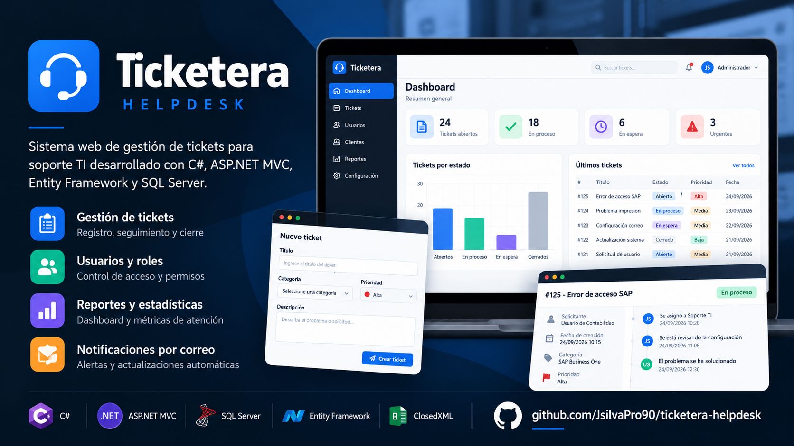
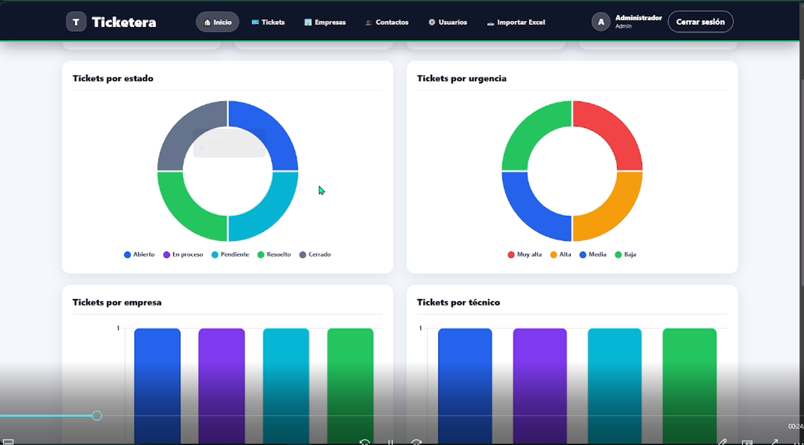
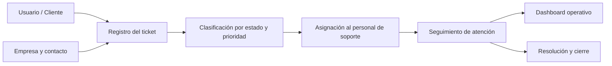
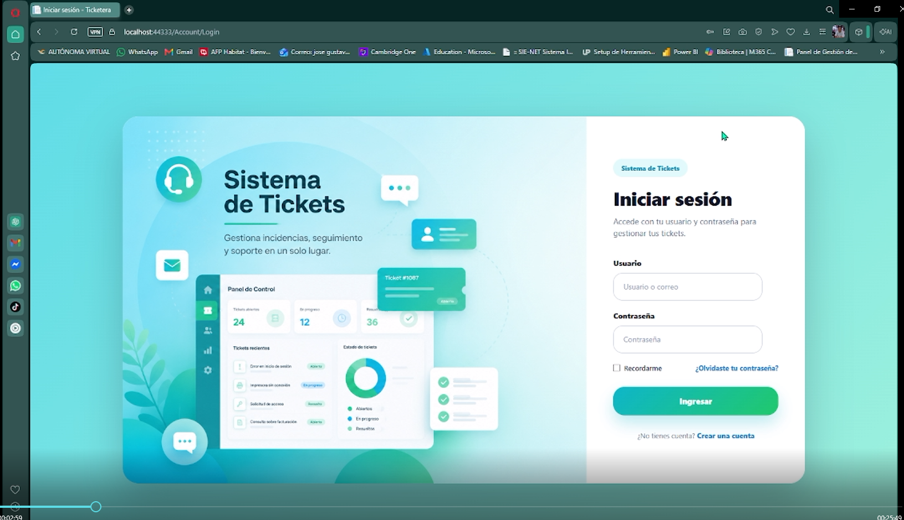
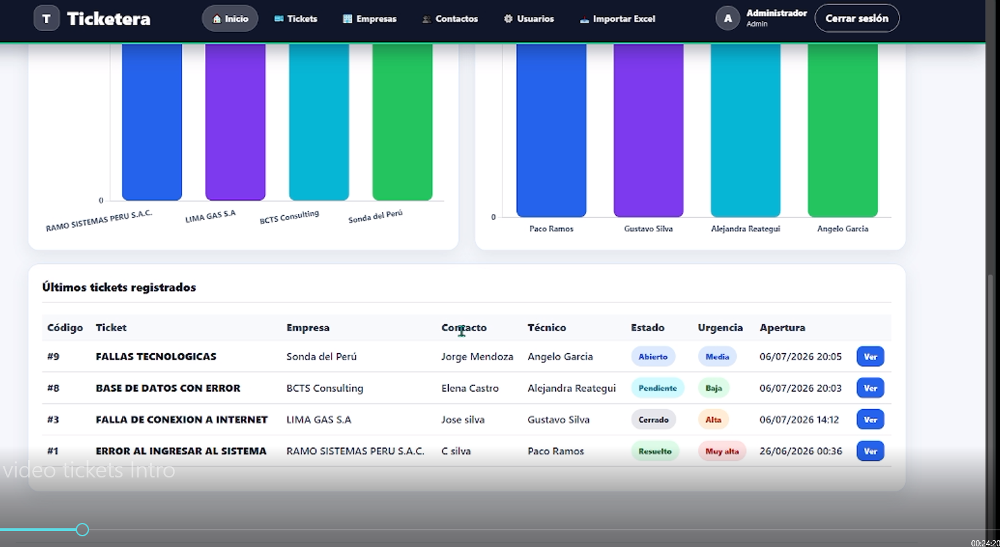
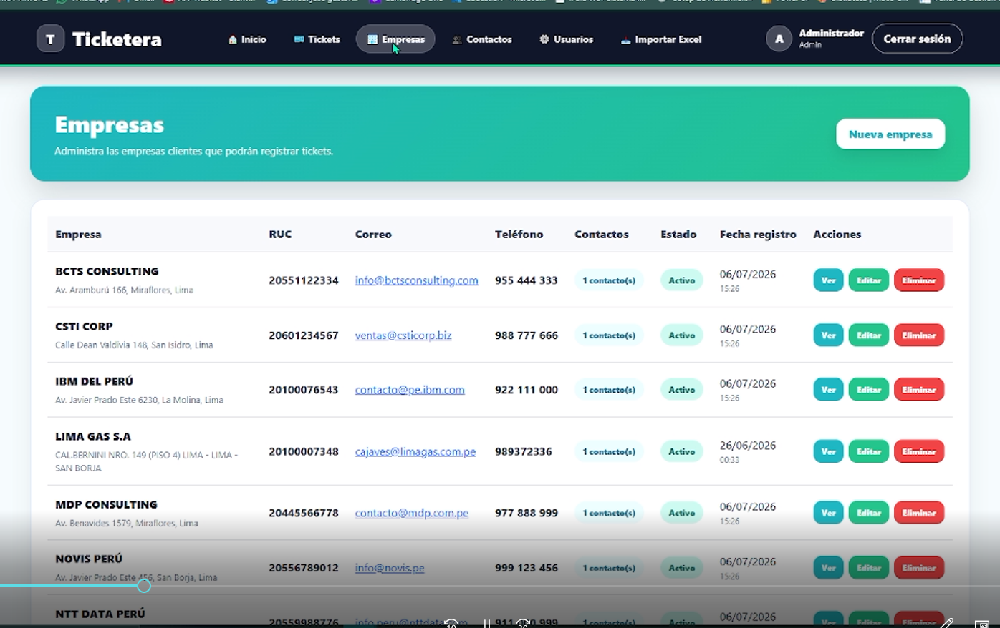
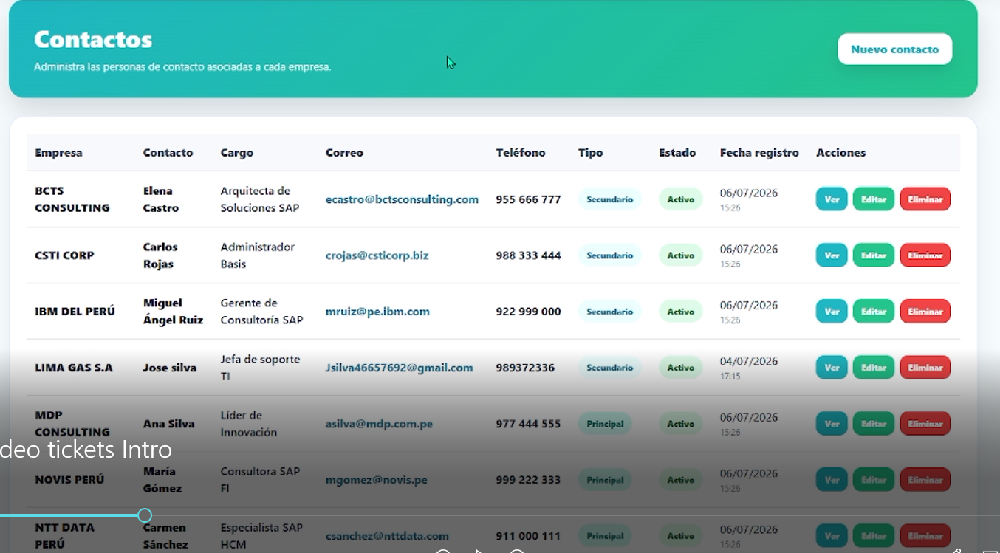
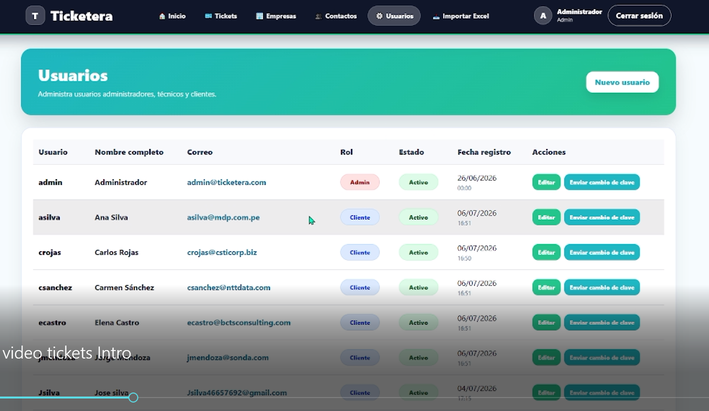
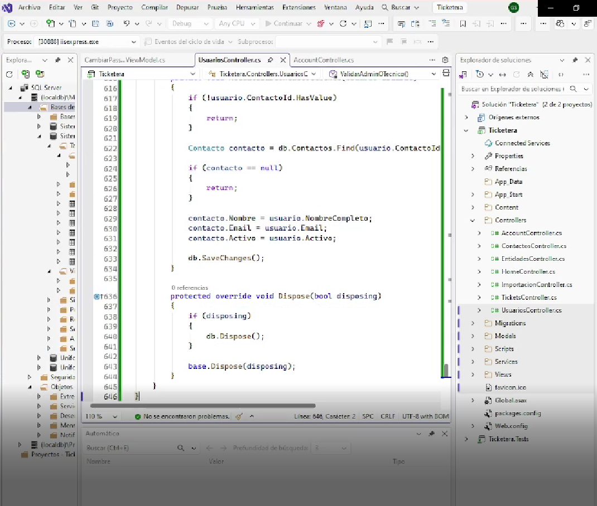
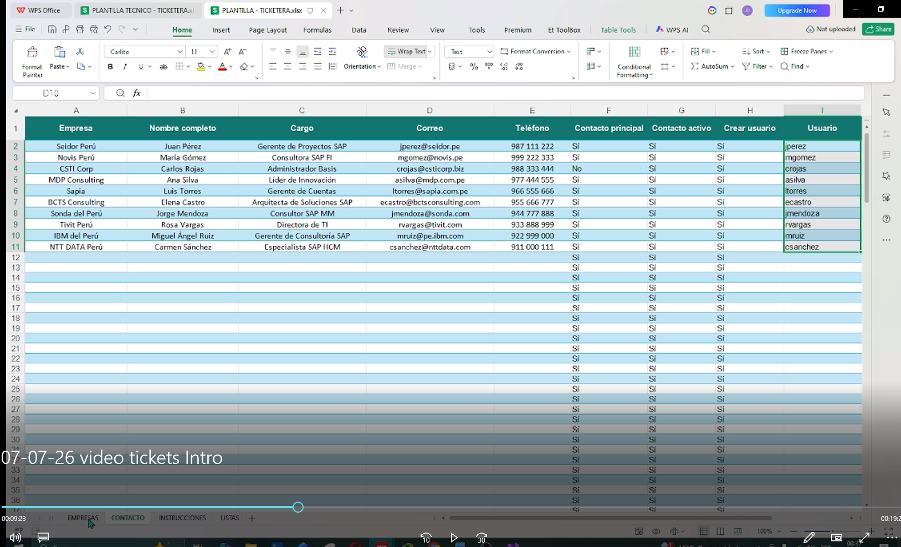

# 🎫 Ticketera · Sistema de gestión de tickets para soporte TI

<p align="center">
  
</p>

<p align="left">
  
  
  
  
  
</p>


## 📌 Descripción del proyecto

**Ticketera** es una solución web de Mesa de Servicio (Help Desk) orientada a centralizar la gestión de incidencias de soporte TI.

El sistema permite transformar solicitudes dispersas provenientes de usuarios en **tickets trazables**, organizados por estado, prioridad y responsable, facilitando el seguimiento operativo mediante un dashboard de control.

El proyecto fue desarrollado como aplicación práctica para fortalecer competencias en:

- Desarrollo web con C# y ASP.NET MVC.
- Diseño de arquitectura MVC.
- Gestión y persistencia de información.
- Modelamiento de bases de datos.
- Automatización de procesos mediante archivos Excel.
- Buenas prácticas de documentación técnica.


---

# 🔗 Enlaces

🌐 **Portafolio Web**  
https://arcan.freedev.app


💼 **LinkedIn**  
https://www.linkedin.com/in/jose-gustavo-silva-medrano/


👨‍💻 **GitHub**  
https://github.com/JsilvaPro90


📂 **Repositorio del proyecto**  
https://github.com/JsilvaPro90/ticketera-helpdesk


---

# 🖥️ Vista general del sistema

<p align="center">
  
</p>

Dashboard operativo para visualizar el estado general de los tickets registrados.


---

# 🎯 Problema que resuelve

En muchas organizaciones las solicitudes de soporte TI suelen gestionarse mediante:

- Correos electrónicos.
- Mensajes internos.
- Comunicaciones informales.
- Solicitudes verbales.

Esto genera:

- Falta de trazabilidad.
- Pérdida de información.
- Dificultad para medir tiempos de atención.
- Poco control sobre responsabilidades.

**Ticketera** propone un flujo estructurado donde cada solicitud:

✅ Se registra como un ticket único.  
✅ Tiene seguimiento por estado.  
✅ Puede asignarse a responsables.  
✅ Se relaciona con empresas y contactos.  
✅ Permite medir la operación mediante indicadores.


---

# 🔄 Flujo funcional




---

# 🚀 Funcionalidades principales

## Gestión de tickets

- Registro de incidencias.
- Seguimiento del ciclo de atención.
- Estados de ticket.
- Priorización por urgencia.
- Asignación a personal de soporte.
- Gestión de adjuntos.


## Administración

- Gestión de usuarios.
- Gestión de roles.
- Administración de empresas.
- Gestión de contactos.
- Control de accesos.


## Dashboard

- Indicadores generales.
- Visualización del estado de tickets.
- Seguimiento operativo.


## Automatización

- Importación masiva desde Excel.
- Procesamiento de archivos `.xlsx`.
- Registro automático de empresas y contactos.


## Comunicación

- Notificaciones por correo electrónico.
- Recuperación y cambio de contraseña.


---

# 📸 Capturas del sistema


## Inicio de sesión

<p align="center">

</p>


## Seguimiento de tickets

<p align="center">

</p>


## Gestión de empresas

<p align="center">

</p>


## Gestión de contactos

<p align="center">

</p>


## Usuarios y roles

<p align="center">

</p>


## Desarrollo

<p align="center">

</p>


---

# 📊 Importación masiva desde Excel

<p align="center">

</p>


La aplicación incorpora una funcionalidad para importar información desde archivos Excel, reduciendo registros manuales y facilitando la carga inicial de datos.

Incluye:

- Lectura de archivos `.xlsx`.
- Procesamiento con ClosedXML.
- Validación de información.
- Registro automático en la base de datos.


---

# 🛠️ Tecnologías utilizadas


| Área | Tecnología |
|-|-|
| Lenguaje | C# |
| Framework | ASP.NET MVC 5 |
| Plataforma | .NET Framework 4.8 |
| ORM | Entity Framework 6 |
| Base de datos | SQL Server |
| Frontend | HTML, CSS, JavaScript, Bootstrap |
| Excel | ClosedXML |
| IDE | Visual Studio |


---

# 🏗️ Arquitectura del sistema


El proyecto utiliza el patrón arquitectónico:

## MVC (Model - View - Controller)


### Models

Contiene:

- Entidades del sistema.
- Modelos de datos.
- ViewModels.
- Acceso mediante Entity Framework.


### Views

Responsables de:

- Interfaz gráfica.
- Formularios.
- Visualización de información.


### Controllers

Gestionan:

- Peticiones del usuario.
- Reglas del flujo.
- Comunicación entre capas.


### Services

Contiene servicios complementarios:

- Envío de correos.
- Procesamiento adicional.


Flujo general:

```
Usuario
  |
  ▼
Views
  |
  ▼
Controllers
  |
  ▼
Models / Entity Framework
  |
  ▼
SQL Server
```


---

# 📚 Documentación técnica


Documentación complementaria del proyecto:


## 🏗️ Arquitectura del sistema

Describe la estructura interna, componentes principales y flujo de información.

[Ver Arquitectura](documentacion/Arquitectura.md)


## 🗄️ Modelo de base de datos

Detalle de entidades, relaciones y estructura utilizada.

[Ver Base de Datos](documentacion/BaseDatos.md)


## ⚙️ Guía de instalación

Pasos para configurar el ambiente local.

[Ver Instalación](documentacion/Instalacion.md)


---

# ⚙️ Instalación local


## 1. Clonar repositorio

```bash
git clone https://github.com/JsilvaPro90/ticketera-helpdesk.git
```


## 2. Abrir solución

Abrir:

```
Ticketera/Ticketera.sln
```


## 3. Restaurar paquetes

Restaurar paquetes NuGet definidos en:

```
packages.config
```


## 4. Configurar conexión

Revisar:

```
Ticketera/Web.config
```


Configurar la cadena:

```
DefaultConnection
```


## 5. Ejecutar proyecto

Iniciar desde Visual Studio.


---

# 🔐 Seguridad


El repositorio no contiene:

❌ Contraseñas reales.  
❌ Tokens privados.  
❌ Cadenas sensibles.  
❌ Credenciales SMTP reales.


Los valores sensibles deben configurarse únicamente en ambientes locales.


Ejemplo:

```xml
<add key="SmtpUser" value="YOUR_EMAIL@gmail.com"/>
<add key="SmtpPass" value="YOUR_APP_PASSWORD"/>
```


Para más información:

[Consultar SECURITY.md](SECURITY.md)


---

# 📌 Estado del proyecto


Proyecto académico desarrollado como práctica profesional para aplicar conocimientos de:

- Desarrollo de software.
- Bases de datos.
- Arquitectura MVC.
- Integración de servicios.
- Documentación técnica.


El proyecto puede continuar evolucionando incorporando nuevas funcionalidades y mejoras.


---

# 👨‍💻 Autor


**José Gustavo Silva Medrano**

Estudiante de Ingeniería de Sistemas


📍 Lima, Perú


GitHub:

https://github.com/JsilvaPro90


LinkedIn:

https://www.linkedin.com/in/jose-gustavo-silva-medrano/


Portafolio:

https://arcan.freedev.app


---

<p align="center">

Proyecto desarrollado con fines académicos y de aprendizaje.

</p>