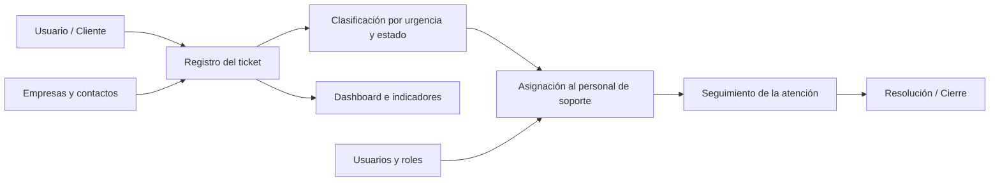

# Ticketera · Sistema de gestión de tickets para soporte TI

<p align="left">
  
  
  
  
  
</p>

**Proyecto académico de desarrollo web orientado a centralizar, organizar y dar trazabilidad a la atención de incidencias de soporte TI.**

[🌐 Ver portafolio](https://arcan.freedev.app/) · [💼 LinkedIn](https://www.linkedin.com/in/gustavo-silva-12b76a408) · [👨‍💻 GitHub](https://github.com/jsilvaPro)

---

<p align="center">
  
</p>

## Descripción

**Ticketera** es un sistema web de Mesa de Servicio (Help Desk) que centraliza la gestión de incidencias mediante tickets trazables. La solución permite registrar solicitudes, clasificarlas por estado y nivel de urgencia, asignarlas al personal de soporte y realizar seguimiento durante su ciclo de atención.

El sistema integra en una misma aplicación la administración de **tickets, empresas, contactos, usuarios y roles**, complementándola con un **dashboard de indicadores operativos**, adjuntos, notificaciones por correo electrónico e importación masiva de información desde Excel.

> El objetivo del proyecto es transformar solicitudes de soporte dispersas en un flujo de atención más ordenado, visible y controlado.

## Flujo general



## Funcionalidades principales

- Autenticación de usuarios.
- Registro y seguimiento de tickets de soporte.
- Clasificación por estado y nivel de urgencia.
- Asignación de tickets al personal de soporte.
- Administración de empresas y contactos.
- Gestión de usuarios y roles.
- Dashboard con indicadores operativos.
- Adjuntos asociados a tickets.
- Notificaciones por correo electrónico.
- Recuperación y cambio de contraseña.
- Importación masiva de empresas y contactos desde Excel.

## Capturas del sistema

<table>
  <tr>
    <td width="50%">
      
      <br><b>Inicio de sesión</b><br>
      Acceso al sistema mediante usuario y contraseña.
    </td>
    <td width="50%">
      
      <br><b>Seguimiento de tickets</b><br>
      Resumen operativo y visualización de incidencias registradas.
    </td>
  </tr>
  <tr>
    <td width="50%">
      
      <br><b>Empresas</b><br>
      Administración de organizaciones atendidas por el sistema.
    </td>
    <td width="50%">
      
      <br><b>Contactos</b><br>
      Personas de contacto asociadas a cada empresa.
    </td>
  </tr>
  <tr>
    <td width="50%">
      
      <br><b>Usuarios y roles</b><br>
      Administración de accesos, roles, estado y acciones de usuario.
    </td>
    <td width="50%">
      
      <br><b>Desarrollo</b><br>
      Proyecto desarrollado en Visual Studio con C# y ASP.NET MVC.
    </td>
  </tr>
</table>

## Funcionalidad destacada · Importación masiva desde Excel

La solución incorpora una opción para cargar **empresas y contactos desde archivos Excel**, reduciendo el registro manual y conectando el procesamiento del archivo con la lógica de aplicación y la persistencia de datos.

<p align="center">
  
</p>

Esta funcionalidad integra:

- Lectura de información desde archivos `.xlsx`.
- Procesamiento mediante **ClosedXML**.
- Registro de empresas y contactos.
- Integración con la información administrada por el sistema.

## Tecnologías

| Área | Tecnología |
|---|---|
| Backend | C# · ASP.NET MVC 5 · .NET Framework 4.8 |
| ORM | Entity Framework 6 |
| Base de datos | SQL Server / LocalDB |
| Frontend | HTML · CSS · JavaScript · Bootstrap |
| Archivos Excel | ClosedXML |
| IDE | Visual Studio |

## Arquitectura general

La solución sigue el patrón **MVC (Model–View–Controller)**:

- **Models:** entidades, ViewModels y acceso a datos.
- **Views:** interfaz de usuario.
- **Controllers:** flujo de solicitudes y lógica de aplicación.
- **Services:** funcionalidades complementarias, como correo y notificaciones.
- **SQL Server:** persistencia de información mediante Entity Framework.

```text
Interfaz web / Views
        │
        ▼
Controllers + lógica de aplicación
        │
        ▼
Models / Entity Framework
        │
        ▼
SQL Server
```

## Configuración local

1. Clona el repositorio:

   ```bash
   git clone https://github.com/jsilvaPro/ticketera-helpdesk.git
   ```

2. Abre `Ticketera/Ticketera.sln` en Visual Studio.
3. Restaura los paquetes NuGet definidos en `packages.config`.
4. Revisa la cadena `DefaultConnection` de `Ticketera/Web.config`.
5. Configura los valores SMTP de ejemplo si deseas probar el envío de correos.
6. Ejecuta las migraciones de Entity Framework si corresponde.
7. Inicia el proyecto desde Visual Studio.

### Configuración SMTP

El repositorio **no incluye credenciales reales**. En `Ticketera/Web.config` se utilizan valores de ejemplo como:

```xml
<add key="SmtpUser" value="YOUR_EMAIL@gmail.com" />
<add key="SmtpPass" value="YOUR_GMAIL_APP_PASSWORD" />
```

Sustituye estos valores únicamente en tu entorno local. **Nunca publiques contraseñas, App Passwords ni credenciales reales.**

## Seguridad del repositorio

Se excluyeron del repositorio archivos generados por Visual Studio, binarios, paquetes restaurables, archivos locales, adjuntos de prueba y configuraciones sensibles.

Consulta [`SECURITY.md`](SECURITY.md) para más información.

## Estado del proyecto

Proyecto académico y de aprendizaje. Su objetivo es aplicar conocimientos de desarrollo web, programación orientada a objetos, bases de datos e integración con archivos Excel sobre un caso práctico de soporte TI.

El proyecto continuará evolucionando conforme incorpore nuevos conocimientos y mejoras.

## Autor

**José Gustavo Silva Medrano**  
Estudiante de Ingeniería de Sistemas · Lima, Perú

- GitHub: [@jsilvaPro](https://github.com/jsilvaPro)
- LinkedIn: [José Gustavo Silva Medrano](https://www.linkedin.com/in/gustavo-silva-12b76a408)
- Portafolio: [arcan.freedev.app](https://arcan.freedev.app/)

---

<p align="center">
  <sub>Proyecto desarrollado con fines académicos y de aprendizaje.</sub>
</p>
